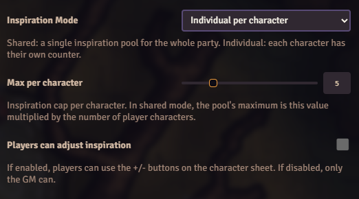
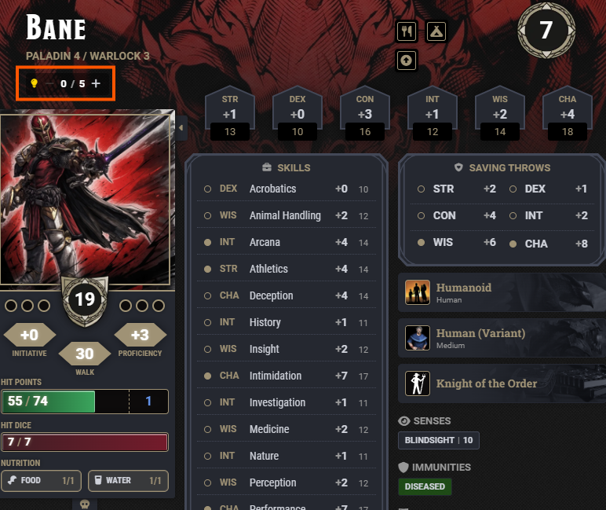
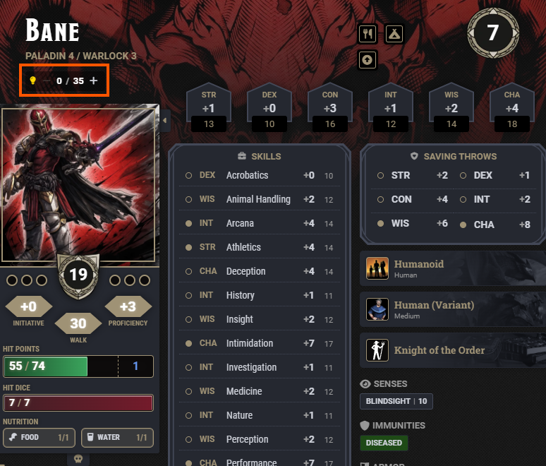
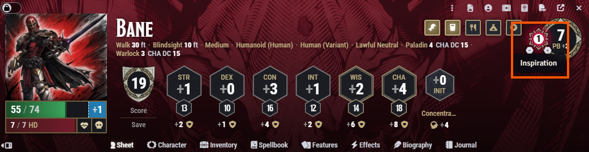
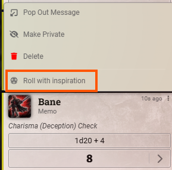
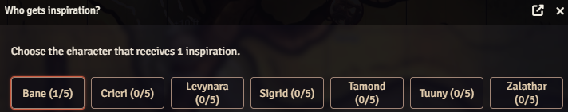

# Really Inspired

   

A Foundry VTT module that manages D&D5e Inspiration, with support for a pool shared by the whole party or an individual counter per character.

## Requirements

- Foundry VTT v13.341+
- dnd5e system v5+
- Tidy5e Sheet (optional, quadrone theme) for native counter integration

## What it does

### Inspiration mode: individual or shared

From **Configure Settings**, the GM chooses how Inspiration works at the table:

- **Individual**: each character has their own counter, just like the standard rules.
- **Shared**: there's a single Inspiration "pool" for the whole party. Any character can draw from that common pool, and what one spends, everyone spends.

There's also a setting for the **maximum Inspiration per character**. In shared mode, the pool's maximum is calculated automatically as that number multiplied by the number of player characters.

### A visible counter on the character sheet

Instead of the small Inspiration icon (which can only be checked or unchecked), the character sheet shows a clear counter with the current amount and the maximum, plus buttons to add or remove. By default only the GM can use them, but there's an option to let players adjust their own Inspiration too.

Individual mode:

Shared mode — the maximum shown is the per-character cap multiplied by the number of party members:

### Tidy5e Sheet support

If [Tidy5e Sheet](https://foundryvtt.com/packages/tidy5e-sheet) is active (quadrone theme), the counter shows through Tidy5e's own built-in inspiration UI instead of a separate widget, using Tidy5e's official integration API — no visual conflicts between the two modules.

### Granting inspiration from chat

When someone makes a roll (a skill check, saving throw, or attack), any player can **right-click that chat message** and choose **"Roll with inspiration"**. That spends 1 inspiration from whoever clicked it (not from whoever made the roll) and creates a new roll to redo that check, always using the modifiers of the character who rolled originally. This lets a player "gift" a reroll to a teammate by spending their own Inspiration.

### The GM can grant inspiration with a keyboard shortcut

Pressing the **"I"** key opens a small dialog for the GM to pick which character gets 1 Inspiration, without needing to open their sheet. The party finds out via a chat message.

### Compatible with the system's regular Inspiration

The module keeps the regular dnd5e Inspiration indicator in sync, in case another module or rules automation relies on it: if a character's counter is 1 or higher, that indicator shows as active; once it reaches 0, it shows as inactive.

## Language

The interface is translated into **English and Spanish**, and automatically follows the language each user has configured in Foundry (Configuration > Language) — no extra setup needed from the GM.
